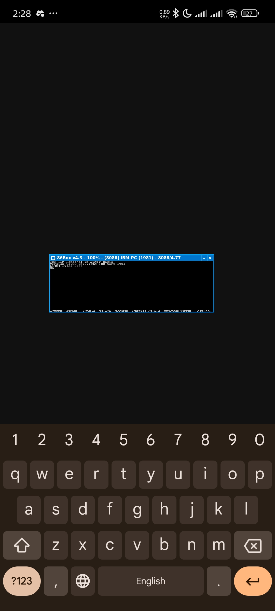

# 86Box Termux Port

This is a Termux-native version of **86Box**, a highly customizable IBM PC emulator focused on full system emulation. Currently, it is built specifically for Termux and does not utilize the Android NDK. An NDK-based port is planned for the future.

## Features
- Simple to build and run directly in Termux.
- Does not require root or additional tools beyond Termux.

## How to Build and Run
Follow these steps to build and run 86Box on Termux:

1. Set the `PKG_CONFIG_PATH` environment variable:
   ```bash
   export PKG_CONFIG_PATH=/data/data/com.termux/files/usr/lib/pkgconfig
   ```

2. Create a build directory and navigate to it:
   ```bash
   mkdir build
   cd build
   mkdir dist
   ```

3. Configure the build using `cmake`:
   ```bash
   cmake .. -DDYNAREC=OFF -DQT=OFF -DUSE_QT6=OFF -DCMAKE_INSTALL_PREFIX=./dist
   ```

4. Compile the source code (adjust `-j 6` for the number of CPU cores available):
   ```bash
   make -j 6
   ```

5. Install the build to the `dist` directory:
   ```bash
   make install
   ```

6. Navigate to the `bin` directory and run 86Box:
   ```bash
   cd dist
   cd bin
   ./86Box
   ```

## Screenshot
Below is an example of 86Box running in Termux:



## Planned Features
- **NDK Port**: Future versions will use the Android NDK for better compatibility and performance.
